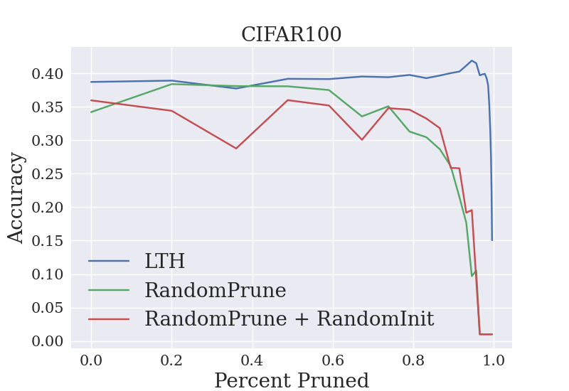
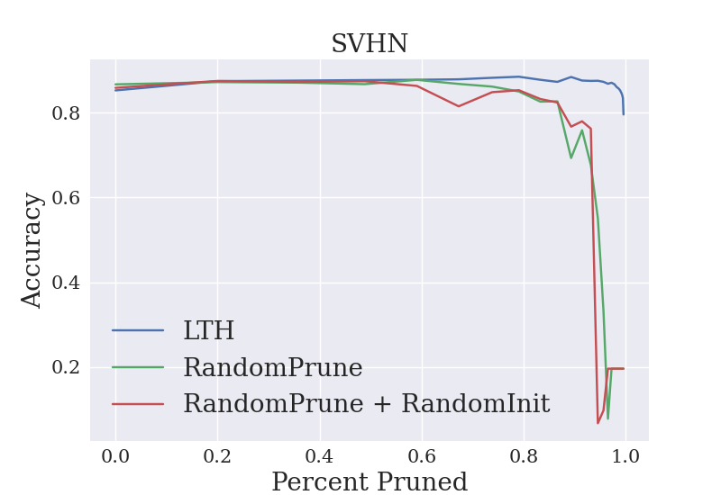

# Global Pruning / Lottery Ticket Hypothesis PyTorch Wrapper
[](LICENSE)

## Global Pruning / Lottery Ticket Hypothesis

Provides a wrapper that can wrap any PyTorch module and can perform global magnitude or random pruning of weights. Supports re-initializing with random weights as well as with a saved state. Additionally, the wrapper supports only pruning certain types of layers.

This wrapper was primarily developed to test the
[Lottery Ticket Hypothesis](https://arxiv.org/abs/1803.03635).

The pruning code is largely inspired by the author's own [implementation](https://github.com/facebookresearch/open_lth) but was designed to be a simple module wrapper to allow for more modularity and for easier portability to existing PyTorch code.

## Requirements
The pruning wrapper itself only requires PyTorch and NumPy, but to run the example code here you can install the necessary requirements using CONDA:
```setup
conda env create --name pruning --file=environment.yml
```
Or look at ``` environment.yml ``` for necessary packages and versions.

## Code Structure
```prune_wrapper.py``` contains the PyTorch wrapper that wraps any nn.module, and enables pruning

```main.py``` contains some testing code for ResNet on CIFAR100, and SVHN to demonstrate the effectiveness of the pruning method

```utils.py``` contains various helper functions for the training process such as data loaders etc.


## Usage
For a detailed explanation of the constructor, methods, and attributes, as well as how to set random pruning or different initialization methods see the comments in ```prune_wrapper.py```.


A basic workflow for running the Lottery Ticket Hypothesis would look like the following:

```python
# Setup model
model = ResNet()
model = PruningWrapper(model,prune_rate=.2,device="cuda",dir_name="run")

# Set this current state to be the state the model is reinitialized to each round
# This can be done at any point (if want to use late resetting)
model.set_initial_weights()

# 25 pruning rounds
for round in range(25):
    # Train normally
    for epoch in range(NUM_EPOCHS):
        ...
    # Check/log what percent of weights have been
    _, _, percent_pruned = model.calculate_percent_pruned()
    log(round, percent_pruned, test_acc)

    # Prune weights
    model.prune_weights()

    # Reinitialize weights to stating state
    model.reinitialize()    
```

To demo the wrapper the code in ```main.py``` performs a basic Lottery Ticket Hypothesis experiment using the ```ResNet50``` architecture on the ```CIFAR100``` and ```SVHN``` data sets.

To run the Lottery Ticket Hypothesis experiments for ```SVHN``` simply run:
```train
python main.py -v
```

For all possible settings see the command line parameters in the ArgumentParser in ```main.py```.

## Experiments
To demonstrate the wrapper the experimental settings listed in ```runs.sh``` were run. The results are displayed below. As can be seen, the model retains its accuracy up to an extreme level of compression, and the best results are when using the same initialization and magnitude pruning as in the Lottery Ticket Hypothesis (LTH) setting.
CIFAR100      |  SVHN   
:-------------------------:|:-------------------------:
  |  

Note these are the results from single runs and with only 45 epochs of training (hence the low accuracy for CIFAR100), I plan on doing more runs with more epochs in the future to reduce the noise, as well as using more data sets.
